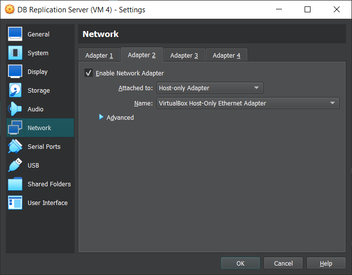

# Database Replication Guide

## Prerequisite

### Setup the Networking for the Source and Replica VMs

1. Go to VM settings 
2. Go to Network
3. Go to Adapter 2 tab
4. Enable the Network Adapter
5. Set the `Attached to` field to `Host-only Adapter`

It should look like this:



### Install SSH on Source and Replica VMs

1. Install openssh server

    ```
    sudo apt install openssh-server
    ```
  

2. Enable the ssh service by typing:

    ```
    sudo systemctl enable ssh
    ```

3. Start the ssh service by typing:

    ```
    sudo systemctl start ssh
    ```

## Step 1 — Adjusting Your Source Server’s Firewall

The command allows any connections that originate from the replica server’s IP address:

Source VM:

```
sudo ufw allow from replica_server_ip_address to any port 3306
sudo ufw allow from replica_server_ip_address to any port 22
```

## Step 2 — Configuring the Source Database

  

Open the MySQL server configuration file on the **source server**.  

Source VM:

```
sudo vim /etc/mysql/mysql.conf.d/mysqld.cnf
```
  

Replace `127.0.0.1` with the source server’s IP address:

File: /etc/mysql/mysql.conf.d/mysqld.cnf

```
. . .
bind-address            = source_server_ip
. . .
```
  
  

Uncomment this line. You can choose any number as the value, but the number must be unique and cannot match any other `server-id` in your replication group.

File: /etc/mysql/mysql.conf.d/mysqld.cnf

```
. . .
server-id               = 1
. . .
```
  

Your replica server must read the source’s binary log file so it knows when and how to replicate the source’s data, so uncomment this line to enable binary logging on the source.

File: /etc/mysql/mysql.conf.d/mysqld.cnf

```
. . .
log_bin                       = /var/log/mysql/mysql-bin.log
. . .
```
  

Lastly, scroll down to the bottom of the file to find the commented-out `binlog_do_db` directive:

File: /etc/mysql/mysql.conf.d/mysqld.cnf

```
. . .
# binlog_do_db          = include_database_name
```
  

Remove the pound sign to uncomment this line and replace `include_database_name` with the name of the database you want to replicate to `ProjectDB`. This example shows the `binlog_do_db` directive pointing to a database named `ProjectDB`. 

File: /etc/mysql/mysql.conf.d/mysqld.cnf
  
```
. . .
binlog_do_db          = ProjectDB
```

After making these changes, save and close the file.

Then restart the MySQL service by running the following command:

Source VM:

```
sudo systemctl restart mysql
```

## Step 3 — Creating a Replication User

Login to mysql as root

Source VM:

```
sudo mysql -u root
```
  

From the prompt, create a new MySQL user. In this case, you will create a user named replica_user. Be sure to change `replica_server_ip` to your replica server’s public IP address and change its `password`:

```
CREATE USER 'replica_admin'@'replica_server_ip' IDENTIFIED WITH mysql_native_password BY 'adminPass';
```
  

After creating the new user, grant them the appropriate privileges. At minimum, a MySQL replication user must have the `REPLICATION SLAVE` permissions:

```
GRANT REPLICATION SLAVE ON *.* TO 'replica_user'@'replica_server_ip';
```
  

Following this, it’s good practice to run the `FLUSH PRIVILEGES` command. This will free up any memory that the server cached as a result of the preceding `CREATE USER` and `GRANT` statements:

```
FLUSH PRIVILEGES;
```

## Step 4 — Retrieving Binary Log Coordinates from the Source

From the prompt, run the following command which will close all the open tables in every database on your source instance and lock them:

Source VM:

```
FLUSH TABLES WITH READ LOCK;
``` 
  

Then run the following operation which will return the current status information for the source’s binary log files:

```
SHOW MASTER STATUS;
```
  

If your source MySQL instance is a new installation or doesn’t have any existing data you want to migrate to your replicas, you can at this point unlock the tables:

```
UNLOCK TABLES;
```
  

### If Your Source Has Existing Data to Migrate  

From the new terminal window or tab, open up another SSH session to the server hosting your source MySQL instance:

Replica VM:

```
ssh username@source_server_ip
```
  

Then, from the new tab or window, export your database using `mysqldump`. The following example creates a dump file named `ProjectDB.sql` from a database named `ProjectDB`. Also, be sure to run this command in the bash shell, not the MySQL shell:

```
sudo mysqldump -u root ProjectDB > ProjectDB.sql
```
  

Return to the terminal that should still have the MySQL shell open. From the MySQL prompt, unlock the databases to make them writable again:

```
UNLOCK TABLES;
```

Then you can exit the MySQL shell:

```
exit
```
  

You can now send your snapshot file to your replica server. You can do this securely with an `scp` command like this:

Source VM:

```
scp ProjectDB.sql username@replica_server_ip:/tmp/
```
  

Be sure to replace `username` with the name of the administrative Ubuntu user profile you created on your replica server, and to replace `replica_server_ip` with the replica server’s IP address. Also, note that this command places the snapshot in the replica server’s `/tmp/` directory.

  

After sending the snapshot to the replica server, SSH into it:

```
ssh username@replica_server_ip
```  
  

Then open up the MySQL shell:

```
sudo mysql -u root
```
  

From the prompt, create the new database that you will be replicating from the source:

```
CREATE DATABASE ProjectDB;
```
  

You don’t need to create any tables or load this database with any sample data. That will all be taken care of when you import the database using the snapshot you just created. Instead, exit the MySQL shell:

```
exit
```


Then import the database snapshot:

```
sudo mysql ProjectDB < /tmp/ProjectDB.sql
```
  

## Step 5 - Configuring the Replica Database

All that’s left to do is to change the replica’s configuration similar to how you changed the source’s. Open up the MySQL configuration file, `mysqld.cnf`, this time on your replica server:

Replica VM:

```
sudo vim /etc/mysql/mysql.conf.d/mysqld.cnf
```
  

As mentioned before, each MySQL instance in a replication setup must have a unique `server-id` value. Find the replica’s `server-id` directive, uncomment it, and change its value to any positive integer different from that of the source:

File: /etc/mysql/mysql.conf.d/mysqld.cnf

```
server-id               = 2
```
  

Following that, update the `log_bin` and `binlog_do_db` values so that they align with the values you set in the source machine’s configuration file:

File: /etc/mysql/mysql.conf.d/mysqld.cnf

```
. . .
log_bin                 = /var/log/mysql/mysql-bin.log
. . .
binlog_do_db            = ProjectDB
. . .
```
  

Add a `relay-log` directive defining the location of the replica’s relay log file. Include the following line at the end of the configuration file:

File: /etc/mysql/mysql.conf.d/mysqld.cnf

```
. . .
relay-log               = /var/log/mysql/mysql-relay-bin.log
```  

Lastly, set sync_binlog to 1 to avoid synchronous issues (**important**): 

File: /etc/mysql/mysql.conf.d/mysqld.cnf

```
. . .
sync_binlog = 1
```

After making these changes, save and close the file. Then restart MySQL on the replica to implement the new configuration:

```
sudo systemctl restart mysql
```

After restarting the `mysql` service, you’re finally ready to start replicating data from your source database.

## Step 6 — Starting and Testing Replication

At this point, both of your MySQL instances are fully configured to allow replication. To start replicating data from your source, open up the the MySQL shell on your replica server:

Replica VM:

```
sudo mysql -u root
```

From the prompt, run the following operation, which configures several MySQL replication settings at the same time. 

- After running this command, once you enable replication on this instance it will try to connect to the IP address  using the username and password.
  - `SOURCE_HOST` => IP address
  - `SOURCE_USER` => username
  - `SOURCE_PASSWORD` => password 
- It will also look for a binary log file and begin reading it from the position after the value of the position set. 
  - `SOURCE_LOG_FILE` => binary log file 
  - `SOURCE_LOG_POS` => position
- Be sure to replace `source_server_ip` with your source server’s IP address. 
- The `replica_user` and `password` should align with the replication user you created.
- The `mysql-bin.000001` log file and `4` sets the binary log coordinates.
- I recommend you type this command out in a text editor before running it on your replica server so that you can more easily replace all the relevant information:

```
CHANGE REPLICATION SOURCE TO
SOURCE_HOST='source_server_ip',
SOURCE_USER='replica_admin',
SOURCE_PASSWORD='adminPass',
SOURCE_LOG_FILE='mysql-bin.000001',
SOURCE_LOG_POS=4;
```
  

Following that, activate the replica server:

```
START REPLICA;
```
  

If you did this correctly, the replica VM will begin replicating any changes made to the `ProjectDB` database on the source.


You can see details about the replica’s current state by running the following operation. The `\G` modifier in this command rearranges the text to make it more readable:

```
SHOW REPLICA STATUS\G;
```
  
Your replica is now replicating data from the source. Any changes you make to the source database will be reflected on the replica MySQL instance. You can test this by registering a new user and checking whether it gets replicated successfully.

### Test if Database Replication Works
  
1. First register a new user on the website.  
  

2. Open up the MySQL shell on the source and replica VMs:

    Source and Replica VMs:

    ```
    sudo mysql -u root -p ProjectDB
    ```
  
3. Show the records of the users from the Source and Replica VMs:

    ```
    Select * from Users;
    ```

4. Make sure the User records match between the Source and Replica VMs.


**Note**: If either of these operations fail to do the database replication, it may be that you have an error somewhere in your replication configuration. In such cases, you could run the `SHOW REPLICA STATUS\G` operation to try finding the cause of the issue. Additionally, you can consult [MySQL’s documentation on troubleshooting](https://dev.mysql.com/doc/mysql-replication-excerpt/8.0/en/replication-problems.html) for suggestions on how to resolve replication problems.

## Resources
- [https://www.digitalocean.com/community/tutorials/how-to-set-up-replication-in-mysql](https://www.digitalocean.com/community/tutorials/how-to-set-up-replication-in-mysql)